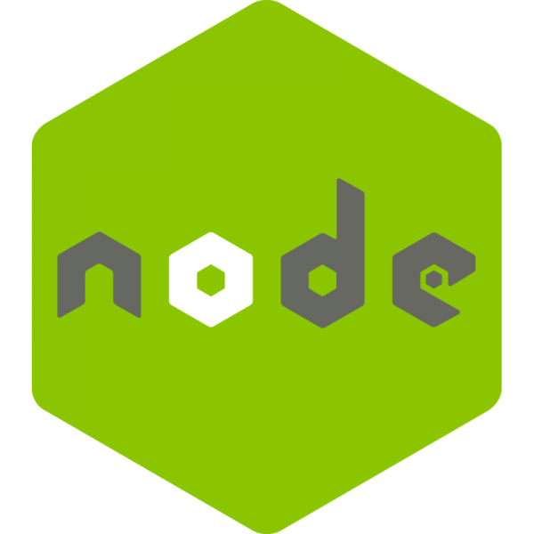

<h1 align="center">👋 Hi everyone, I'm Tuasn</h1>

 

<h1>📋 About Me:</h1>

<ul>
<li><h2>Name: <strong>Tuasn</strong></h2></li>
<li><h2>Age: <strong>10</strong></h2></li>
<li><h2>From: <strong>Vietnam </strong></h2></li>
</ul>

 

<h1 align="left">📊 Stats and Info:</h1>

 

 

<h1>💻 Languages and Tools:</h1>

 

<h1>🏆 Achievements:</h1>

 

<h1>✉️ Connect with me:</h1>

 

